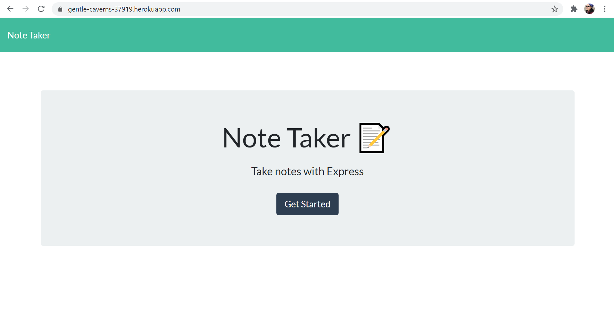
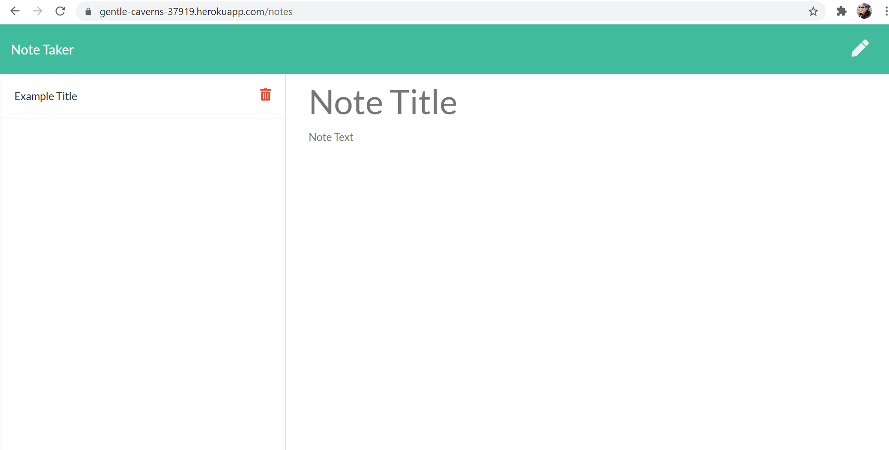

# Note Taker

## Table of Contents
* [Description](#description)
* [Installation](#installation)
* [Usage](#usage)
* [Contributing](#contributing)
* [Tests](#tests)
* [License](#license)
* [Questions](#questions)

## Description <a name="description"></a>
This Javascript application is a Note Taker that allows a user to write and save notes.  The application is run from the Heroku cloud platform.  The application starts at a Landing page in which the user clicks a "Get Started" button to navigate to the "Notes" page which has the main functionality of adding notes, deleting notes, and the ability to view existing notes.  The intent of this application was to create the back-end of the application using Express.js.  All front-end HTML, CSS, and JS functionality was provided as starter code.  

Although the starter code was provided, and therefore not expected to be revised, I did revise the index.js file for the following reasons:
1. The ```renderActiveNote``` function contained an error.  The ```noteText.value``` was set to ```activeNote.title``` instead of ```activeNote.text```, which prevented the existing notes from displaying the task text correctly in the right-hand column of the Notes page.  See ```index.js``` line 60 for corrected code.
2. The ```renderActiveNote``` function originally did not allow the user to add new notes with the "pencil" icon after the user viewed an existing note.  As provided, the function forced the ```noteTitle``` and ```noteText``` values to an attribute of ```readonly``` after viewing an existing note.  I revised the ```else``` condition to remove the attribute upon rendering the active note.  See ```index.js``` lines 62 - 65 for corrected code.


The application is deployed at the following live URL:
https://gentle-caverns-37919.herokuapp.com/

This is the landing page for the application as deployed through Heroku:


After clicking the "Get Started" button, you should see the following:


## Installation <a name="installation"></a>
To run the code for edits to this application, please do the following: 

1. Clone the application's respository from GitHub onto your local drive.  
2. Set up the ```npm``` package by running the following command in the root directory of the application: 
    
    ```
    npm install
    ```
    
    This will download the application's dependencies into your root directory.  You should now have a folder called ```node_modules``` and a file called ```package-lock.json```.
3. Set up the ```uuid npm``` package by running the following command in the root directory of the application:

    ```
    npm install uuid
    ```

    This will add the uuid dependencies required to generate the unique ID's required for the ```post``` route in the ```dataRoutes.js``` file.  You should now see ```uuid``` listed under the ```dependencies``` property with a version number.
4. Set up ```Express``` by running the following command in the root directory of the application:

    ```
    npm init -y
    ```
    ```
    npm i express
    ```

    This will initialize npm and install the Express.js npm package.  You should now see ```express``` listed under the ```dependencies``` property with a version number.

## Usage <a name="usage"></a>
Once installation is complete, to use the application, type the following into the command line at the root directory of the application:

    npm start
    
The application will start the local server and allow you to view any revisions you make to the code.

## Contributing <a name="contributing"></a>
Contributions are welcome.  Please contact me regarding improvements you would like to make.

## Tests <a name="tests"></a>
This application does not use any testing methods.

## License <a name="license"></a>
This application is covered under the ISC license.

## Questions <a name="questions"></a>
My GitHub username is plainjane99.  Please feel free to peruse my other projects.

If you have any questions regarding this application, please contact me via email at jane99hsu@gmail.com.
  